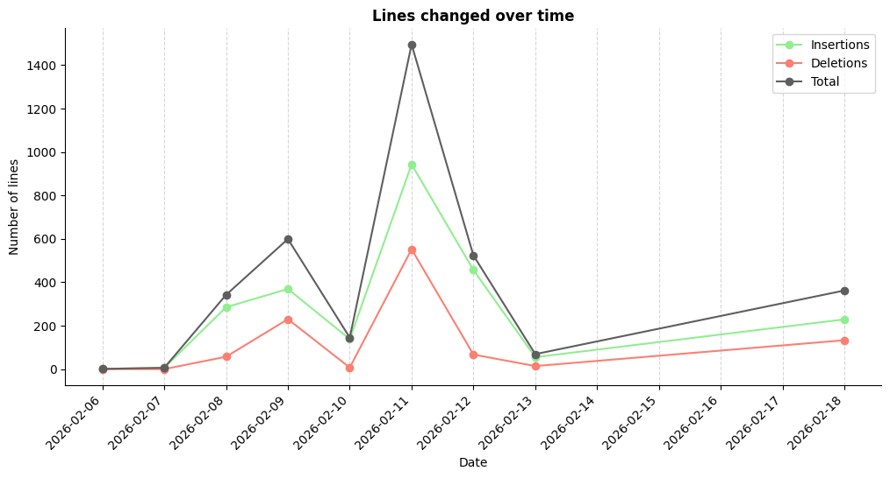
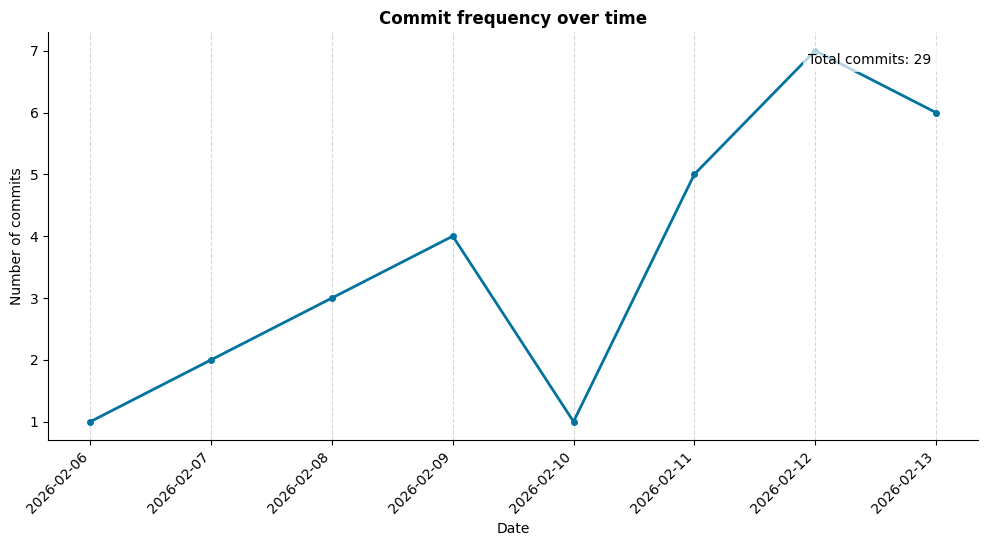

[](https://classroom.github.com/a/nkxJlVK3)

# Git Repository Inspector

## What is this project about?
This project provides a command-line tool to analyze a local Git repository.  It extracts information such as:

- Commit activity
- Lines added/removed
- Changed files
- Commit rhythm (weekly/hourly patterns)
- Message statistics

You can generate plots (bar charts, heatmaps, timelines, etc.) to visualize the extracted metrics.

Example with ```python3 main.py --repo "." --plot -m "lines" --output-dir "./plots_md"```:
<figure>
  
  <figcaption>Figure 1: Lines changed over time (2026-02-18 20:58).</figcaption>
</figure>

## Installation
If you don’t have done yet, clone this repository using `git clone`.

### Without docker

- Requirements:

  - Python 3.11+
  - Git installed on the system
  - pip packages (see below)

- Install dependencies (with venv or another environment):
```pip install -r requirements.txt```

- Run locally:
```python3 main.py --repo "path/to/repository"```

### With docker
You can run it inside a Docker container to avoid installing dependencies locally.

- Build the image with the already contained dockerfile:
```docker build -t repo-inspector .```

- Run a bash session inside the container, mounting your chosen repository and output directories:
```docker run -v "path/to/repository:/repo" -v "path/to/output:/output" -it repo-inspector bash```

<em>Note: You need to mount these directories because Docker cannot access your host filesystem by default. 
Both paths must be passed using -v. To simplify access, use :/repo and :/output after your local paths.
</em>

Example: ```docker run -v "$(pwd):/repo" -v "$(pwd):/output" -it repo-inspector bash```, which uses this repo and saves the output plots in the same directory.


- **IMPORTANT**: Mark the repository as safe inside the container:
```git config --global --add safe.directory /repo```

- Run the CLI inside the container. For example, to analyze the "lines" metric and generate all plots (more examples below):
```python3 main.py --repo /repo -m --plot --output-dir /output```

## How to use

### CLI-Arguments

The tool is controlled through command-line arguments.
Below is an overview of all available options:

```--repo``` / ```-r```
Path to a valid git repository. <b>This argument is required</b>.

```--metric``` or ```-m``` 
Select the metric to analyze.
Available choices:
- ```all```
- ```commits```
- ```lines```
- ```authors```
- ```files```
- ```rhythm```
- ```messages```

<em>(Note: Not all metrics support all plot types.)</em>

```--since```
Start date in ```(YYYY-MM-DD)``` format

```--until```
 End date in ```(YYYY-MM-DD)``` format

```--authors``` or ```-a```:
Filter commits by author. Expects a comma-seperated list.

```--branches``` or ```-b```:
Filter commits by branch. Expects a comma-seperated list.

```--plot``` or ```-p```:
Plot the analyzed results.

```--output-dir```
Directory where generated plots will be saved.

```--ext```
Output file format for saved plots.
Options: ```png```, ```svg```, ```pdf```

### Examples
Plot and save every plot of this repo:
```bash
python3 main.py --repo "." --p --output-dir "./plots"
```
Plot commits with a url:
```bash
python3 main.py --repo "https://github.com/freiburg-missing-semester-course/project-dnl07.git" \
--metric "commits" -p --output-dir "./plots"
```

<figure>
  
  <figcaption>Figure 2: Commit frequency over time (2026-02-18 20:58).</figcaption>
</figure>

## Changes after the reviews

- Simplified plot options: ```--plot``` is now a simple boolean, selecting a type like “bar” or “pie” is no longer required, reducing confusion.

- Added an all option for ```--metric``` to allow plotting all available metrics at once.

- Added a ```--list``` option to display basic usage instructions directly in the terminal.

- Improved error handling: errors are now displayed without Python tracebacks and in color for better readability.

- Branch handling: commits from each branch are now analyzed and plotted separately, rather than being merged together.

- Added support for repository URLs as an input option.

- Updated this file to show more examples

- Fixed filtering by authors: Now names with a space within work too